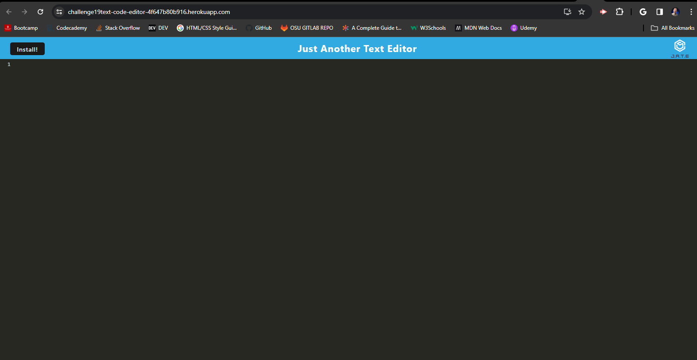

# <Challenge 19 Text and Code Editor>

## Description

A downloadable web based application that allows you to edit text and code while offline

## Installation

Go to the web page in your browser, and select the download icon in the top right of your search/navigation bar as seen in the photo below.

## License

MIT License

Copyright (c) 2024 Michael Arrasmith

## Site Links

Github Repository
https://github.com/MArrasmith/Challenge19TextCode-Editor

Site Address
https://challenge19text-code-editor-4f647b80b916.herokuapp.com/

Walk Through Video
https://drive.google.com/file/d/1BlUWH4doc16vXeuainxR-yBfxNHraDcB/view

## Author

This site was completed by Michael Arrasmith, utilizing starter code provided by The Ohio State University Full Stack Web Development bootcamp in partnership with edX.

https://github.com/MArrasmith

https://www.linkedin.com/in/michael-arrasmith-47b10b296/

